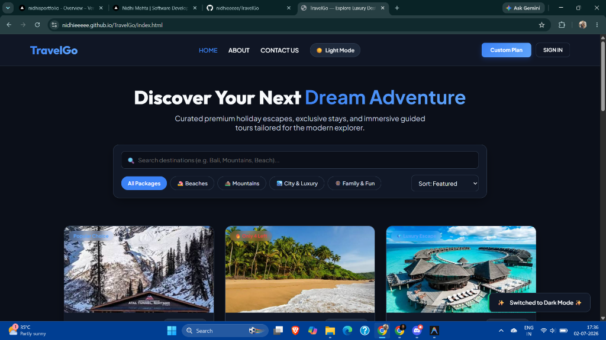
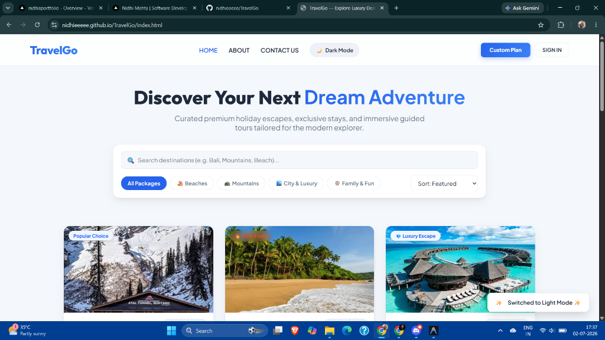

<div align="center">

# ✈️ TravelGo — Explore Luxury Destinations

**Curated Premium Holiday Escapes, Exclusive Stays, and Immersive Guided Tours Tailored for the Modern Explorer.**

[](https://nidhieeeee.github.io/TravelGo/index.html)
[](#)
[](#)
[](#)
[](#)

---

### 🌟 [CLICK HERE FOR LIVE DEMO](https://nidhieeeee.github.io/TravelGo/index.html) 🌟

</div>

---

## ✨ Overview

**TravelGo** is a modern, responsive, and interactive frontend travel application designed to deliver an exceptional UI/UX experience. Featuring dynamic search, category filtering, interactive day-by-day itineraries, custom tour planning, and seamless **Dark & Light Mode** theming, TravelGo reflects state-of-the-art web development standards.

---

## 🎨 Visual Showcase

Experience TravelGo in tailored aesthetics designed for visual comfort and high engagement.

### 🌙 Dark Mode Theme
Sleek glassmorphic dark mode tailored for low-light environments and maximum contrast.


### ☀️ Light Mode Theme
Vibrant, sun-kissed light mode highlighting vivid destination imagery and crisp typography.


---

## 🚀 Key Features

* **⚡ Real-time Destination Search**: Instantly search across global holiday packages by destination, activity, or region (e.g., *Bali, Mountains, Beach*).
* **🎯 Smart Category Filtering**: Seamlessly filter packages by curated themes:
  * 🏖️ *Beaches*
  * 🏔️ *Mountains*
  * 🏙️ *City & Luxury*
  * 🎡 *Family & Fun*
* **📅 Interactive Day-by-Day Itineraries**: Click on **View Details** for any package to explore comprehensive day-by-day travel schedules, inclusions, hotel ratings, and real-time pricing.
* **🌓 Dynamic Dark & Light Mode**: Switch between visual aesthetics with animated toast notifications and persistent theme support.
* **🗺️ Custom Tour Planning Form**: A dedicated interactive form (`form.html`) allowing users to design personalized itineraries and calculate budget estimations.
* **📱 100% Responsive & Mobile Friendly**: Carefully built with CSS Grid and Flexbox for seamless browsing across desktops, tablets, and smartphones.

---

## 🛠️ Technology Stack

| Technology | Purpose |
| :--- | :--- |
| **HTML5** | Semantic web structure and accessible markup |
| **Vanilla CSS3** | Custom properties (variables), Glassmorphism, Flexbox, Grid, & animations |
| **JavaScript (ES6+)** | Dynamic DOM manipulation, filtering logic, and state management |
| **Google Fonts** | Modern typography powered by *Outfit* and *Plus Jakarta Sans* |

---

## 📂 Folder Structure

```text
TravelGo/
├── images/               # Destination photography & UI theme previews
│   ├── kullumanali.jpg
│   ├── goa.jpg
│   ├── maldives.jpg
│   ├── preview-dark.png  # Dark mode showcase
│   └── preview-light.png # Light mode showcase
├── index.html            # Main destination exploration page
├── about.html            # Developer profile & technology overview
├── form.html             # Custom trip planning & contact portal
├── styles.css            # Global styling & dark/light mode design tokens
├── styleabout.css        # Styling for about page
├── styleform.css         # Styling for custom planner page
└── app.js                # Core interactive frontend engine
```

---

## 💻 Getting Started Locally

To run or modify TravelGo locally on your machine:

1. **Clone the Repository:**
   ```bash
   git clone https://github.com/nidhieeeee/TravelGo.git
   cd TravelGo
   ```

2. **Launch the Application:**
   Simply open `index.html` in your favorite web browser (or use VS Code Live Server for hot reloading).

---

## 👤 Developer

**Developed with ❤️ by Nidhi Mehta**

* **GitHub**: [@nidhieeeee](https://github.com/nidhieeeee)
* **LinkedIn**: [Nidhi Mehta](https://www.linkedin.com/in/nidhi-mehta-89340b2b2)

---

<div align="center">
  <sub>⭐️ Star this project if you love exploring world destinations! ⭐️</sub>
</div>
